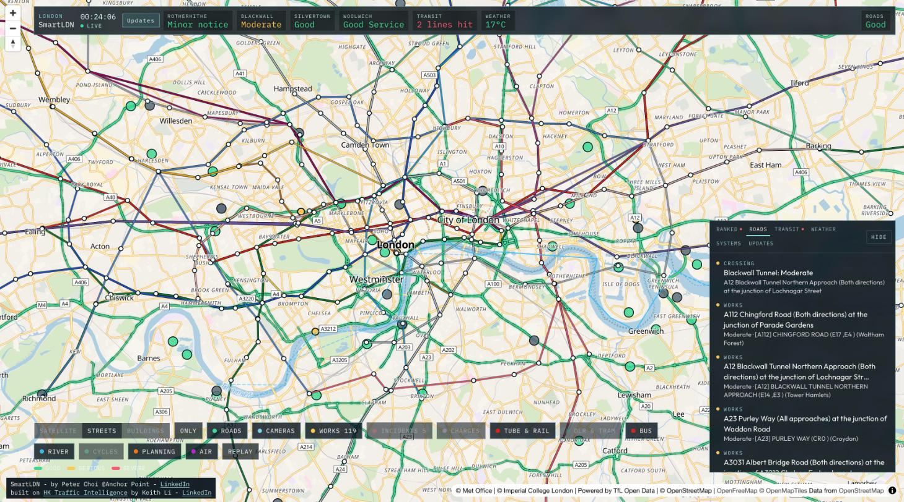

# SmartLDN

**Live:** [labs.palapple.com/smartldn](https://labs.palapple.com/smartldn) · by Peter Choi, Anchor Point ([LinkedIn](https://www.linkedin.com/in/peterchoicm))



A live map of Greater London that puts the open data London already publishes in one place: the TfL road corridors, the Thames crossings, Tube, Elizabeth line, Overground, DLR, tram, bus and river arrivals, road works and incidents, traffic cameras, Santander Cycles, weather and flood warnings, air quality, planning applications, and the Congestion Charge and ULEZ zones.

SmartLDN is a London port of [HK Traffic Intelligence](https://github.com/keithligh/hk-traffic-intelligence) by [Keith Li](https://github.com/keithligh), a Hong Kong smart city dashboard released under the MIT License. The map engine, the moving trains, the stop plates and the ranked Intel panel are his work. The data layer, the layers and the copy were rebuilt for London.

## What the dashboard shows

**Roads.** Each of the 24 TfL road corridors (the North and South Circulars, the radial A roads, the Inner Ring, the cross routes, and the Blackwall and Silvertown tunnels) is drawn in the status TfL publishes: Good, Serious, Severe or Closed. TfL does not publish live road speeds, so the colour is a status, not a speed. Road works and incidents come from the TfL traffic control centre, each placed at its own point with severity, closures, timing and the latest update. About 800 JamCams show a still, and a ten-second clip on request.

**Thames crossings.** The header reads the four crossings east of Tower Bridge: Rotherhithe Tunnel, Blackwall Tunnel, Silvertown Tunnel and the Woolwich Ferry. Each shows the status TfL publishes for it. There is no open journey-time feed for these crossings.

**Rail.** Tube, Elizabeth line and Overground trains move along their lines, together with DLR, trams and the Uber Boat river buses. Tube and Elizabeth line trains are followed by the train number TfL publishes. Elsewhere a train's position is estimated from the published minutes and the distance between stations, because TfL does not publish one. Station cards show the next departures, the line status, lift outages and, for Tube stations, how busy the station is against a usual day.

**Buses.** From district zoom, every bus in view moves on the map from its live GPS position, gliding between reports, with its route and destination on a plate at street level. Opening a London bus shows where it started, its next stops with times from TfL (matched by registration), and its route highlighted on the map. Bus stops show their routes, and a stop card reads the live arrivals.

**City.** Santander Cycles docks are coloured by bikes available. Air quality comes from the London Air Quality Network. Planning applications from all 35 London planning authorities show sites where work has started, and applications validated in the last four months. The Congestion Charge zone, the London-wide ULEZ, and the Dartford, Blackwall and Silvertown charge points are drawn as a reference layer.

**Weather.** Met Office warnings that reach Greater London, with their areas drawn on the map, Environment Agency flood warnings within Greater London, the temperature in central London, and the heaviest recent rain at the London gauges.

**Intel.** When several things need attention at once, the Intel panel ranks them: a dead feed, a severe incident, a suspended line, a closed crossing, a severe corridor, serious works, a flood warning, or very high air pollution. The tabs are Ranked, Roads, Transit, Weather, Systems and Updates.

## Where the numbers come from

| On the map | Open data |
| --- | --- |
| Road corridor status | TfL Unified API [`/Road`](https://api.tfl.gov.uk/swagger/ui/index.html#!/Road) |
| Corridor shapes | [OpenStreetMap](https://www.openstreetmap.org/copyright) ways for each corridor's road numbers, clipped to the bounds TfL publishes (built by `scripts/build-london-data.mjs`) |
| Road works and incidents | TfL [`/Road/all/Disruption`](https://api.tfl.gov.uk/swagger/ui/index.html#!/Road) |
| Traffic cameras | TfL JamCams, [`/Place/Type/JamCam`](https://api.tfl.gov.uk/swagger/ui/index.html#!/Place) |
| Tube, Elizabeth line, Overground, DLR, tram, river bus arrivals | TfL [`/Line/{ids}/Arrivals`](https://api.tfl.gov.uk/swagger/ui/index.html#!/Line) |
| Station and line network | TfL `/Line/{id}/Route/Sequence` (built by `scripts/build-london-data.mjs`) |
| Line status | TfL `/Line/Mode/{modes}/Status` |
| Lift outages | TfL `/Disruptions/Lifts/v2` |
| Station busyness | TfL `/Crowding/{naptan}/Live` |
| Bus stops and arrivals | TfL `/StopPoint` search and `/StopPoint/{id}/Arrivals` |
| Live bus positions | DfT [Bus Open Data Service](https://data.bus-data.dft.gov.uk) SIRI-VM, filtered to Greater London (TfL buses report as operator TFLO) |
| Santander Cycles | TfL `/BikePoint` |
| Weather warnings | Met Office [Weather DataHub](https://datahub.metoffice.gov.uk) NSWWS warnings API, with warning areas (free key, `METOFFICE_NSWWS_KEY`); without a key, the [warnings RSS for London & South East](https://www.metoffice.gov.uk/public/data/PWSCache/WarningsRSS/Region/se) |
| Flood warnings and rainfall | Environment Agency [real-time flood-monitoring API](https://environment.data.gov.uk/flood-monitoring/doc/reference) |
| Temperature | Met Office Weather DataHub Site-Specific "Global Spot" hourly forecast for central London (free key, `METOFFICE_SITE_KEY`); without a key, [Open-Meteo](https://open-meteo.com) |
| Air quality | [London Air Quality Network](https://www.londonair.org.uk), Imperial College London |
| Planning applications | GLA [Planning London Datahub](https://www.london.gov.uk/programmes-strategies/planning/digital-planning/planning-london-datahub) |
| Congestion Charge and ULEZ zones | [London Datastore](https://data.london.gov.uk/dataset/london-wide-ultra-low-emission-zone-2023-vd455) |
| Street map and buildings | [OSM Bright](https://github.com/openmaptiles/osm-bright-gl-style) and [OSM Liberty](https://github.com/maputnik/osm-liberty), served by [OpenFreeMap](https://openfreemap.org), from [OpenStreetMap](https://www.openstreetmap.org/copyright) contributors |
| Satellite photograph | [Esri World Imagery](https://server.arcgisonline.com/ArcGIS/rest/services/World_Imagery/MapServer). Imagery © Esri |

TfL, Environment Agency, Met Office, GLA and London Datastore data are used under the [Open Government Licence v3.0](https://www.nationalarchives.gov.uk/doc/open-government-licence/version/3/). Powered by TfL Open Data. The full Hong Kong to London mapping, including what London does not publish, is in [docs/london-data-mapping.md](docs/london-data-mapping.md).

## Running it

You need Node.js 22.

```bash
npm install
cp .env.example .env.local
npm run dev
```

Open [http://127.0.0.1:4317](http://127.0.0.1:4317). Put a free TfL key from [api-portal.tfl.gov.uk](https://api-portal.tfl.gov.uk) in `.env.local` as `TFL_APP_KEY`. It runs without one, but TfL limits anonymous use to about 50 requests a minute. Live bus positions need a free key from the [Bus Open Data Service](https://data.bus-data.dft.gov.uk/account/signup/) as `BODS_API_KEY`; without it the map shows stops and arrivals but no moving buses.

| Command | What it does |
| --- | --- |
| `npm run dev` | Next.js on port 4317 |
| `npm run lint` | ESLint |
| `node --test src/lib/*.test.ts` | Unit tests |
| `node scripts/build-london-data.mjs [rail] [corridors] [zones]` | Rebuilds the static files in `data/` from TfL, OpenStreetMap and the London Datastore |
| `npm run dev:vinext` | The Cloudflare-oriented dev server on port 4318 |

## Hosting on Cloudflare

The site runs as a Cloudflare Worker (vinext). Every visitor reads one shared copy of each feed: trains about every fifteen seconds, road status and line status every minute, disruptions every two minutes, and the rest less often. Upstream services see the same traffic whether one person or a thousand have the map open.

1. Set `TFL_APP_KEY`, `BODS_API_KEY`, `METOFFICE_NSWWS_KEY` and `METOFFICE_SITE_KEY` as Worker secrets: `npx wrangler secret put TFL_APP_KEY`, and the same for the others.
2. Optional: create a KV namespace for the daily page-open counter and set `SMARTLDN_VISITS_KV_ID` before building (see `cloudflare.config.ts`). It counts opens only, without cookies.
3. Build and deploy with `npm run build:vinext`, then deploy through your usual Wrangler flow.

The Tube, Elizabeth line and Overground arrivals, and the London bus positions, are each several megabytes per refresh, so the Workers Paid plan's CPU allowance is the comfortable fit.

## Known limits

These are worth knowing before relying on the map:

- **Road colours are a status, not a speed.** TfL publishes Good, Serious, Severe or Closed for 24 corridors and no live road speeds. A few central corridors (Inner Ring, City Route, the cross routes) are drawn from the road numbers they are signed on, so their shapes are approximate.
- **Train positions outside the Tube are estimates.** Tube and Elizabeth line trains are followed by the train number TfL publishes; DLR, Overground, tram and river positions are worked out from the published minutes and the distance between stations. Rail lines are drawn straight between stations.
- **Buses lag by up to about a minute.** Each bus reports every 10 to 30 seconds and the feed is read every 20 seconds. About one London bus in four has no TfL stop predictions (out of service or finishing a trip).
- **The Thames crossings have no journey times.** None is published as open data; each crossing shows its TfL status or the notices that name it.
- **Accessibility is partial and not yet audited.** The panels, tabs and controls are real buttons and tabs that work from the keyboard, but the map itself is visual. Everything urgent is also listed as text in the Intel panel.

## Roadmap

- Every borough street-works permit from DfT [Street Manager](https://department-for-transport-streetmanager.github.io/street-manager-docs/open-data/) open data. The receiver is built (`/api/streetworks/sns`); the map layer follows once the feed is approved.
- Road-following track shapes for the DLR, Overground and Elizabeth line.
- Met Office hourly extras in the Weather tab: chance of rain, wind gusts, UV.

## Independence, privacy and attribution

SmartLDN is an independent open-source project. It is not an official TfL, Greater London Authority or Met Office service; check TfL before you travel. Powered by TfL Open Data. Contains public sector information licensed under the [Open Government Licence v3.0](https://www.nationalarchives.gov.uk/doc/open-government-licence/version/3/).

The site sets no cookies and keeps no identifiers. It counts page opens per day, and nothing about who opened them. Your layer and basemap choices are kept in your own browser so the map opens the way you left it. Map tiles load from OpenFreeMap and Esri, which see the request as any tile server does.

## License and credit

MIT, see [LICENSE](LICENSE). SmartLDN keeps the original copyright notice. If you fork or reuse the work, please credit [HK Traffic Intelligence](https://github.com/keithligh/hk-traffic-intelligence) and [Keith Li](https://github.com/keithligh) as well as this project.
